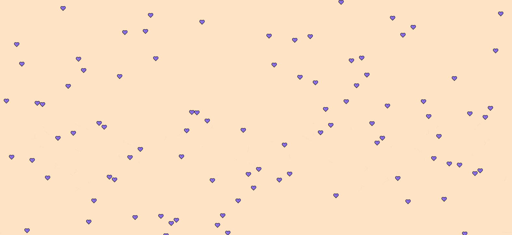
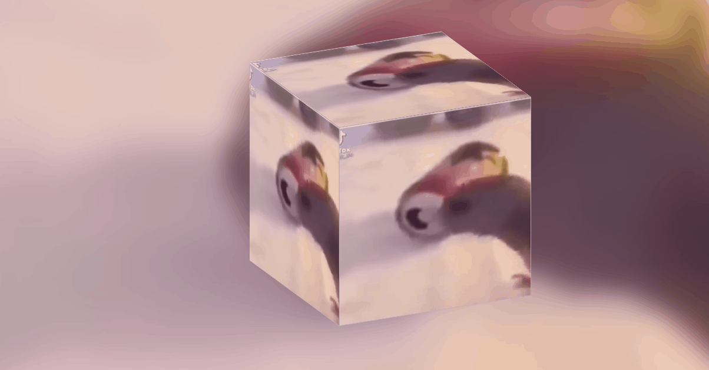
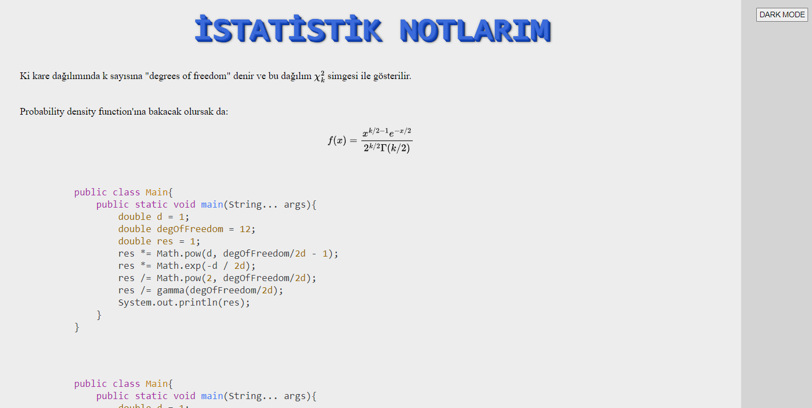
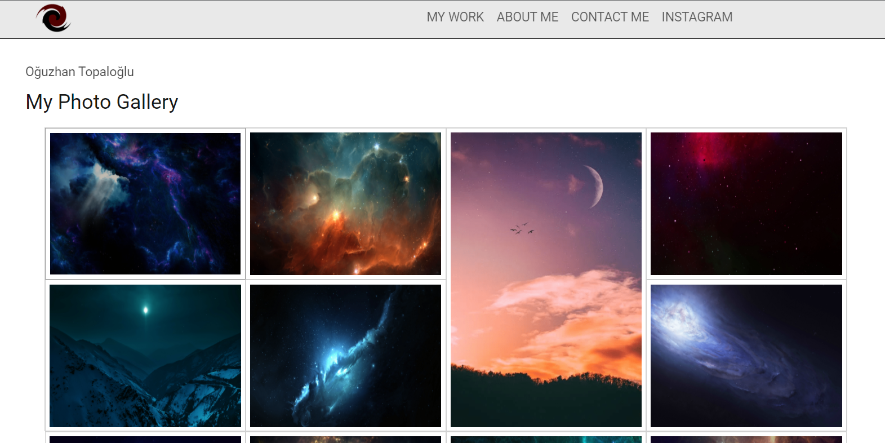
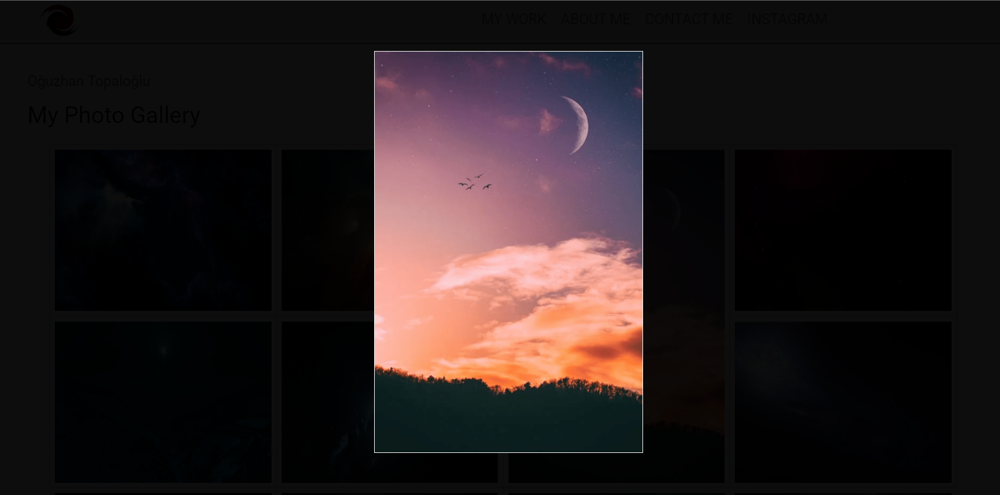
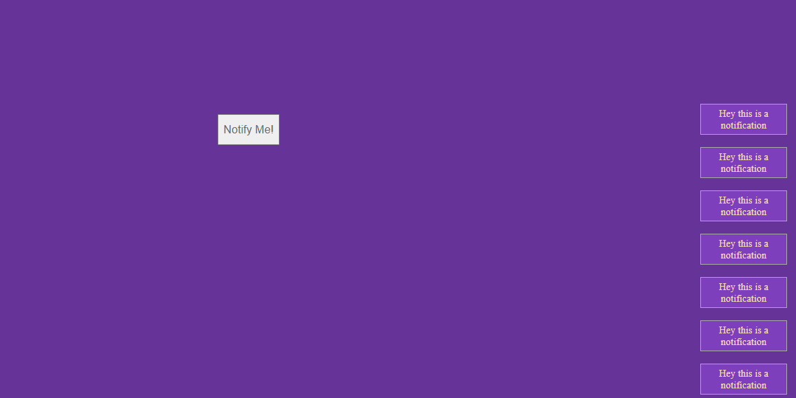
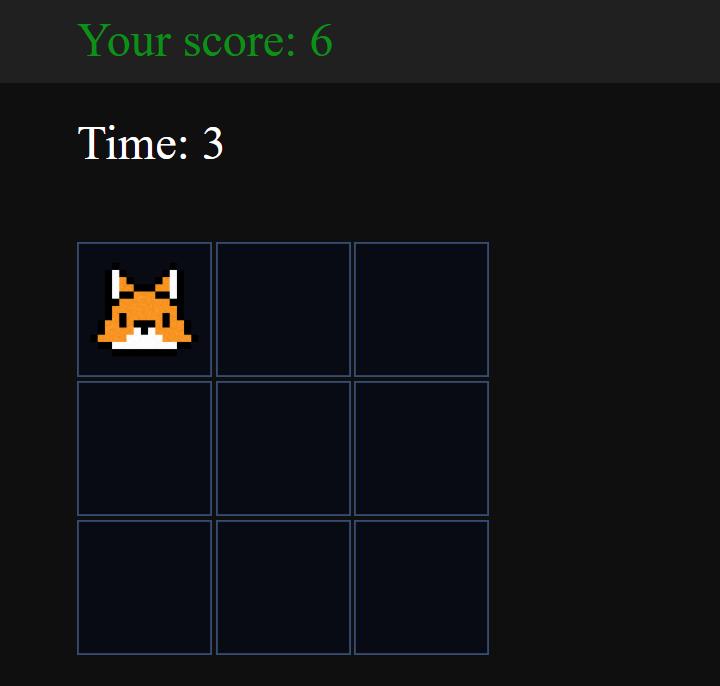

# VanillaJS Playground
Many small frontend projects I made using vanilla JS.  
Any major JS framework like React was never used on purpose.  
In addition to JS, I also used HTML, CSS and SASS.

# Image/Gif Gallery

### Purple Heart Effect

  

 

### Video Cube

  

 

### HighlightJS and MathJax Demo

  

 

### Image Gallery

  
  

 

### Notification Effect

  

 

### Whach A Mole

  

